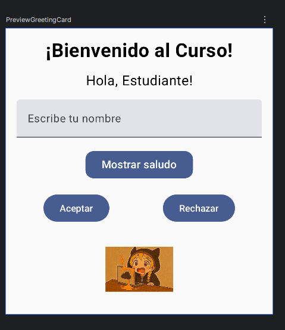
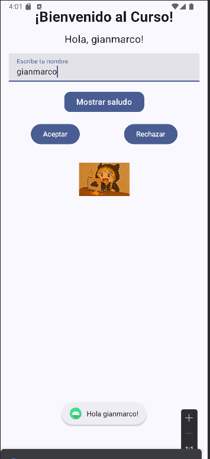

# Bienvenidos al Curso 📱

Proyecto Android desarrollado en **Kotlin** con **Jetpack Compose** para el curso de Desarrollo de Aplicaciones Móviles.  

## 📌 Contenido
- Uso de **Column** y **Row** para organizar layouts.  
- Implementación de **Text**, **TextField**, **Button** e **Image**.  
- Personalización de botones (color, forma y tamaño de fuente).  
- Ejemplo de manejo de estado con `remember { mutableStateOf() }`.  
- Vista previa con `@Preview` y ejecución en **emulador**.  

## 🚀 Requisitos
- Android Studio (versión recomendada: **Arctic/Chipmunk** o superior).  
- Kotlin configurado.  
- SDK mínimo: **API 24**.  

## ▶️ Ejecución
1. Clonar el repositorio:  
   ```bash
   git clone https://github.com/gmarko-dV/labDessMov.git
   
## 📷 Evidencias

### Preview en Android Studio


### Ejecución en Emulador

   
